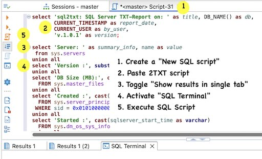

# db2txt
Useful SQL scripts for DBAs and DEVs.

These pure SQL, simple, textual, database configuration and statistics scripts
can be used from any client to extract most intresting information for DBAs and DEVs.
Currently MySQL, PostgreSQL, Oracle, ClickHouse, and SQL Server scripts are available.

## Sections

Even if the report contents greatly depend on the database architecture
there are common sections for all databases:

* `summary_info` summary database informations as version, size, number of users, number of objects, ...
* `version` current database version and information about lastest supported versions
* `schema_matrix` reports the number of objects (eg. tables, indexes) for each schema or database
* `user_list` reports the configured users and their grants
* `current_query` reports most intresting information about current database avtivities
* `locks` reports current locks giving precedence to blocking locks
* `tuning_parameters` most intresting tuning parameters and statistics
* `query_top20` top time consuming queries
* `replication` replication and similar features are reported in this section
* `biggest_objects` space usage from different points of view
* `all_parameters` all database parameters
* `global_status` database status details

Some queries can have a large number of records (eg. all_parameters)
and have been limited to 29 rows; of course the limit can be easly changed to better suite your needs.

## Usage

Any SQL client program can be used to execute the 2TXT-Report scripts.

With DBeaver choose the database you want to use (superadmin rights are suggested),
from the "SQL Editor" create a "New SQL Script", paste the 2TXT-Report script,
toggle "Show results in single tab", activate the "SQL Terminal" output tab,
and finally "Execute SQL script".

Scripts can also be used with native clients as described in the following sections.

### MySQL

The script can be executed from the native client too:

	mysql  -p$PWD  --force -t  <my2txt.sql  2>/dev/null  >my2txt.txt 

All the provided sections are present for MySQL.

Supported version is 8.4 but my2txt is known to work with other versions and forks too.
`SHOW BINARY LOG STATUS` has been introduced in MySQL 8.4 and gives an unimportant
error with previous MySQL versions.

### PostgreSQL

The script can be executed from the native client too:

	psql  [database] --pset=footer=off <pg2txt.sql  2>/dev/null   >pg2txt.txt 

If already connected with psql the following options give a better formatting:

	\pset footer off
	\o pg.txt
	\i pg2txt.sql 

There are several addictional sections for PostgreSQL: `table_deads` and `table_bloats` for detecting
dead tuples, bloat and vacuum execution; `index_issue` to detect missing indexes, ...
There is not a `global_status` section since PostgreSQL uses several different system views
we collected in the `tuning_parameters` section.

Supported version is 17 but pg2txt is known to work quite well with all supported versions.
Column `toplevel` in `pg_stat_statements` is available since PG14, comment it out if using a previous PG version.

### Oracle

The script can be executed from the native client too:

	sqlplus / as sysdba  <ora2txt.sql  2>/dev/null  >ora2txt.txt 

Supported version is 19c but ora2txt is known to work with other versions too, even if 12c+ is suggested.

### ClickHouse

The script can be executed from the native client too:

	clickhouse-client -mn --ignore-error -f PrettyCompactMonoBlock --ask-password <ch2txt.sql  2>/dev/null  >ch2txt.txt 

`all_parameters` and `global_status` sections queries are limited to 29 since the number
of available options and statistic is very high in ClickHouse; of course the limit can
be removed if need.

Supported version is 24.8.*-lts but ch2txt is known to work well with other versions too.

### SQL Server

The script can be executed from the native client too:

	sqlcmd -S serverName\instanceName,1433 -E -d dbName -y 5 -Y 20 -i sql2txt.sql > sql2txt.txt 

`global_status` sections queries are limited to 29 since the number
of available statistic is very high. The limit can be removed if need.

Supported version is 16.0 (SQL Server 2022) but sql2txt is known to work well with other versions too.

## Limits

These are easy SQL scripts: they report only the most intresting information.
Only recent, supported and widely used versions are supported
even if the scripts generally work well also with older or newer versions, forks, compatible DBs, cloud service, ...

The source code of **db2txt** scripts is published on
[https://github.com/meob/db2txt](https://github.com/meob/db2txt).

If you want more information, version/fork specific queries, and better formatted results...
use **db2html** HTML scripts available on
[https://github.com/meob/db2html](https://github.com/meob/db2html).

# LICENSE

Copyright 2025 meob

Licensed under the Apache License, Version 2.0 (the "License");
you may not use this file except in compliance with the License.
You may obtain a copy of the License at

[http://www.apache.org/licenses/LICENSE-2.0](http://www.apache.org/licenses/LICENSE-2.0)

Unless required by applicable law or agreed to in writing, software
distributed under the License is distributed on an "AS IS" BASIS,
WITHOUT WARRANTIES OR CONDITIONS OF ANY KIND, either express or implied.
See the License for the specific language governing permissions and
limitations under the License.
